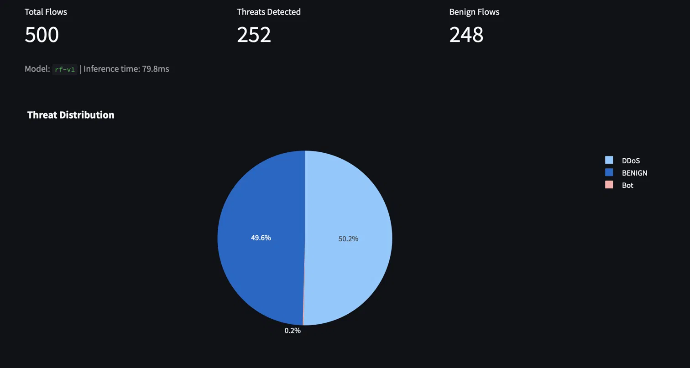
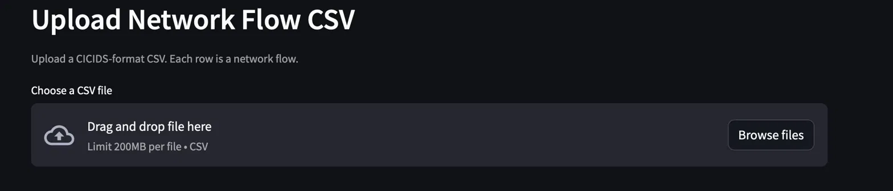
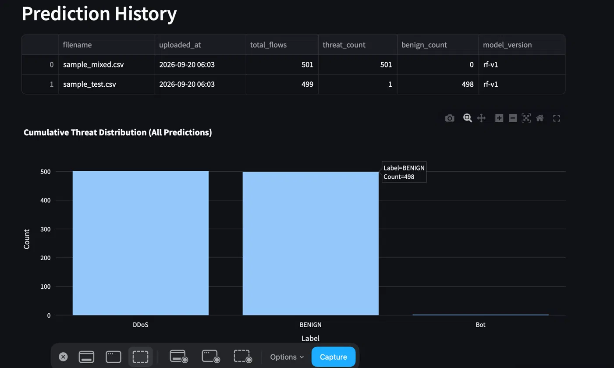

# Network Threat Analyzer

> **TL;DR** — A full-stack network intrusion detection app: upload CICIDS-format network-flow CSVs and get real-time per-flow threat classifications (benign vs. attack type) with a personal history dashboard. Random Forest model (0.9981 weighted F1) served via a FastAPI backend, Streamlit frontend, PostgreSQL, containerized with Docker and deployed on Render.
>
> **Live demo:** https://network-threat-analyzer-n27b.onrender.com
> *(Free tier — the first request may take 30–60s to wake the service, then it's responsive. If the app errors on first load, wait a moment and retry.)*

## Demo

**Upload** — drop in a CICIDS-format network-flow CSV:



**Results** — per-upload threat breakdown; here the model cleanly separates benign traffic from a DDoS attack within one file (rf-v1, ~80ms inference):



**History** — per-user prediction history with cumulative threat distribution:



## Stack

- **Backend:** FastAPI + PostgreSQL (SQLAlchemy) + JWT auth
- **Frontend:** Streamlit
- **ML:** Random Forest (production) vs LSTM (PyTorch), tracked with MLflow
- **Infra:** Docker + docker-compose, GitHub Actions CI

## Architecture

```
Streamlit UI
     ↓ HTTP
FastAPI Backend  ←→  PostgreSQL (prediction history)
     ↓
ML Inference (Random Forest)
```

## Getting Started

### Prerequisites
- [Docker Desktop](https://www.docker.com/products/docker-desktop/) installed and running
- Git

### 1. Clone the repo

```bash
git lfs install    # install Git LFS first so model files download correctly
git clone https://github.com/KK1234-stack/network-threat-analyzer.git
cd network-threat-analyzer
```

### 2. Set up environment variables

```bash
cp .env.example .env
```

Open `.env` and set your values:

```
POSTGRES_USER=postgres
POSTGRES_PASSWORD=yourchosenpassword
POSTGRES_DB=threat_analyzer
DATABASE_URL=postgresql://postgres:yourchosenpassword@db:5432/threat_analyzer
SECRET_KEY=any-long-random-string
```

### 3. Get the trained model (Git LFS)

The trained model and preprocessing artifacts (`rf_model.pkl`, `scaler.pkl`, `label_encoder.pkl`) are stored in the repo via [Git LFS](https://git-lfs.com/). Install LFS **before** cloning, or the files will come down as small pointer stubs instead of the real models:

```bash
git lfs install
# if you already cloned before installing LFS:
git lfs pull
```

That's it — no manual model download needed.

### 4. Start the app

```bash
docker-compose up --build
```

This starts three services:
- **PostgreSQL** — database
- **FastAPI backend** — http://localhost:8000
- **Streamlit frontend** — http://localhost:8501

First build takes 3–5 minutes. Subsequent starts are fast.

### 5. Use the app

1. Open http://localhost:8501
2. Register an account and log in
3. Upload a CICIDS2017-format CSV to get threat classifications
4. View prediction history in the History tab

API docs (Swagger UI): http://localhost:8000/docs

### Stopping the app

```bash
docker-compose down          # stop containers
docker-compose down -v       # stop and delete the database volume
```

## ML Training

Training was done on the CICIDS2017 dataset. See `ml/eda_and_training.ipynb` for the full EDA, preprocessing decisions, and training runs.

To retrain locally:

```bash
cd ml
pip install -r requirements.txt

# 1. Download CICIDS2017 dataset into ml/data/
# 2. Preprocess
python preprocess.py

# 3. Train both models (tracked in MLflow)
python train.py

# 4. Evaluate
python evaluate.py

# MLflow UI
mlflow ui  # opens at http://localhost:5000
```

## Model Results

Trained on CICIDS2017 (2.83M flows, 12 classes). Random Forest is the production model.

| Model | Weighted F1 | Macro F1 |
|---|---|---|
| **Random Forest** | **0.9981** | **0.89** |
| LSTM | 0.9746 | 0.76 |

### Per-class RF Results

| Class | Precision | Recall | F1 |
|---|---|---|---|
| BENIGN | 1.00 | 1.00 | 1.00 |
| DDoS | 1.00 | 1.00 | 1.00 |
| DoS Hulk | 1.00 | 1.00 | 1.00 |
| PortScan | 0.99 | 1.00 | 1.00 |
| DoS GoldenEye | 0.99 | 1.00 | 0.99 |
| DoS Slowhttptest | 0.99 | 0.99 | 0.99 |
| DoS slowloris | 0.99 | 1.00 | 1.00 |
| FTP-Patator | 1.00 | 1.00 | 1.00 |
| SSH-Patator | 1.00 | 1.00 | 1.00 |
| Web Attack - Brute Force | 0.79 | 0.57 | 0.67 |
| Bot | 0.46 | 0.99 | 0.63 |
| Web Attack - XSS | 0.36 | 0.68 | 0.47 |

Bot and Web Attack classes score lower due to limited real samples in the original dataset (under 2k each).

## Dataset

[CICIDS2017](https://www.unb.ca/cic/datasets/ids-2017.html) — Canadian Institute for Cybersecurity.
2.83M network flows across 8 days, 12 traffic classes (1 benign + 11 attack types).

Preprocessing steps: strip column whitespace, drop inf/NaN rows, remove 13 constant/near-constant/duplicate columns, undersample BENIGN to 200k, SMOTE minority classes to 50k minimum, StandardScaler.

## Roadmap / Future Work

### Retraining on New Data
The model should improve over time as users submit real-world traffic. The intended future flow:

```
User uploads CSV → backend saves it to persistent storage
                          ↓
              Admin reviews + verifies predictions
                          ↓
         Retrain on CICIDS2017 + accumulated user submissions
                          ↓
              Better model deployed automatically
```

This requires a labeling workflow (admin marks predictions correct/incorrect), persistent upload storage (S3 or a mounted volume), and a combined training pipeline that merges the original `.npy` arrays with new labeled CSVs.

The backend scaffolding for this already exists — `app/routes/retrain.py` and `app/ml/trainer.py` implement background retraining with MLflow tracking and automatic model promotion. They are not currently registered in the API (no endpoint is exposed) because there is no training data or labeling workflow on the server yet. Re-enabling is a one-line change in `main.py` once those are in place.

### Flexible Input Formats & In-App Feature Extraction
Currently the system requires CSVs pre-processed by **CICFlowMeter** — exactly 65 named flow-level features in the right column format. This is a significant friction point for real users.

Two planned improvements:

**Flexible CSV input:** Accept CSVs from other IDS datasets (NSL-KDD, UNSW-NB15) or custom formats. A format-detection + normalisation layer would map whatever columns the user provides to the 65-feature space the RF expects.

**In-app feature extraction from raw traffic:** Users with `.pcap` files or live packet captures should not need CICFlowMeter installed locally. Planned approach:
```
.pcap upload → scapy/dpkt packet parser → flow feature extraction
             → 65-feature format → existing RF classifier
```

A longer-term alternative is a deep learning model with automatic feature extraction (CNN or Transformer on raw packet bytes), removing the need for hand-engineered features entirely.

### LSTM Inference

The LSTM model is trained and tracked in MLflow alongside RF during every retraining run. The promotion logic already exists — if LSTM's weighted F1 exceeds RF's, it gets promoted to Production in the model registry automatically.

However, the inference path for LSTM is not wired up (`model.py` raises `NotImplementedError` in the LSTM branch). The reason this hasn't been prioritised: **RF is extremely unlikely to lose**. RF achieved 0.9981 weighted F1 on CICIDS2017 tabular data. The LSTM architecture used here reshapes the 65 flat features into an artificial 10-step sequence, which is not a natural fit — LSTM is designed for data where the order of inputs carries meaning (e.g. time series, text). On tabular statistical features, RF consistently dominates.

To fully wire up LSTM inference if it ever does win:
- Load the model state dict from `lstm_model.pt` in `load_model()`
- Implement the reshape + forward pass in the `elif _model_type == "lstm"` branch of `run_inference()`
- Batch inference in chunks (as CUDA OOM was hit during evaluation on full dataset)

## Testing

19 tests covering auth and predictions.

```bash
# Run inside the Docker container
docker-compose exec backend python -m pytest tests/ -v
```

Tests use an in-memory SQLite database — no Postgres needed. CI runs them automatically on every push via GitHub Actions.

## CI/CD

| Workflow | Trigger | What it does |
|---|---|---|
| `ci.yml` | Every push / PR to main | Lint + 19 tests |
| `deploy.yml` | Manual only (workflow_dispatch) | Deploys to Render |

Deploy never triggers automatically — only when you click "Run workflow" in the GitHub Actions tab. To enable deployment, add `RENDER_DEPLOY_HOOK_BACKEND` and `RENDER_DEPLOY_HOOK_FRONTEND` as GitHub secrets.

## Deployment

Deployed on [Render](https://render.com) as two web services (backend + frontend) plus a managed PostgreSQL instance — mirroring the local docker-compose setup in the cloud.

- **Backend & frontend** build from their respective `Dockerfile`s; the frontend reaches the backend via a `BACKEND_URL` env var.
- **Model artifacts** are baked into the backend image at build time (Render has no volume mounts, unlike local docker-compose), pulled via Git LFS during the build.
- **Config & secrets** (`DATABASE_URL`, `SECRET_KEY`, `ADMIN_EMAIL`, etc.) are set as environment variables in the Render dashboard, not committed.

> Both services run on Render's free tier and spin down after ~15 min of inactivity; the first request after idle takes 30–60s to wake them.

## Project Structure

```
network-threat-analyzer/
├── backend/
│   ├── app/
│   │   ├── core/             # config, database, security
│   │   ├── models/           # SQLAlchemy ORM models
│   │   ├── routes/           # auth, predictions
│   │   └── ml/               # inference + background trainer
│   ├── models/               # rf_model.pkl — bundled into image for deploy (Git LFS)
│   ├── processed/            # scaler.pkl, label_encoder.pkl (Git LFS)
│   ├── tests/                # pytest test suite (19 tests)
│   ├── requirements.txt      # core deps (used by CI + Docker)
│   └── requirements-ml.txt   # heavy ML deps (torch — Docker only)
├── frontend/                 # Streamlit app
├── ml/                       # Training pipeline (run independently)
│   ├── eda_and_training.ipynb
│   ├── preprocess.py
│   ├── train.py
│   ├── evaluate.py
│   ├── processed/            # scaler.pkl, label_encoder.pkl (Git LFS)
│   └── models/               # rf_model.pkl (Git LFS); lstm_model.pt gitignored
├── .github/workflows/
│   ├── ci.yml                # lint + tests on every push
│   └── deploy.yml            # manual deploy to Render
└── docker-compose.yml
```
